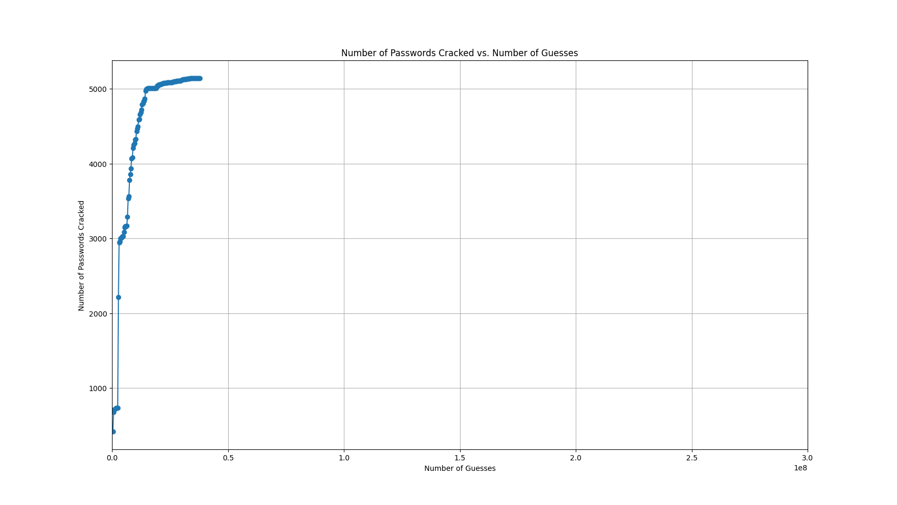
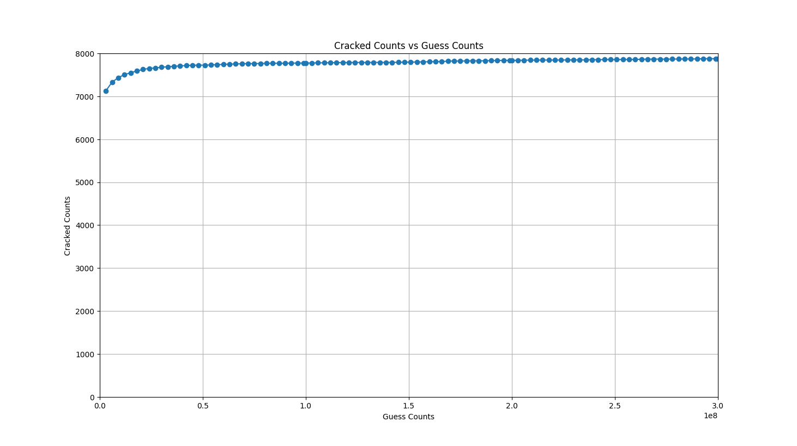

# 算法复现

## 复现设置

- **数据集**：Myspace 4.1w样本，训练集和测试集各占50%。
- **JTR（John the Ripper）**：
  - 使用 `dic-0294` 字典，基于默认规则集生成3700万条密码。
  - 命令：
    ```bash
    john --wordlist=dic-0294.txt --rules --stdout > C:\Users\zephyrus\Desktop\output.txt
    ```
- **PCFG**：
  - 参考09论文中的概率计算方法与优先队列设置，并使用训练集计算L段概率。

## 复现用时

- **总密码数量**：3亿个，分三阶段生成。
- **时间消耗**：
  - 第一阶段：46分钟
  - 第二阶段：54分钟
  - 第三阶段：105分钟
- **密码匹配**：
  - 分三阶段进行，每亿密码的匹配时间约为2.5小时。

## 结果分析

- **JTR 结果**：
  - 
  - JTR与09论文中的结果基本一致，由于数据集大小差异，在规模（scale）上有所不同。最高值约为5100，原论文为6200左右。
  
- **PCFG 结果**：
  - 
  - PCFG的结果与09论文有较大差异。与原论文相比，增长较为缓慢，但在300万的猜测数下表现良好，相较原PCFG提升明显。与JTR方法相比，在3000万猜测数时，PCFG提升了53%。
  - **差异原因分析**：
    1. 训练集样本有限（2w），能够提供的L段替换数远少于字典提供的替换数，导致在大猜测数下，基于字典的训练能破解更多密码。
    2. 训练集提供的L段替换更贴合测试集的情况，同时由于替换数较少，基于训练集的方法更快尝试了可能性最大的pre-terminal，因此在较小猜测数下效果显著，较原方法有明显提升。

## 可以改进的地方

1. **特殊字符S段替换中的转义字符问题**：
   - 如果替换段中存在 `\\`，使用Python编写时可能产生歧义。程序仅对末尾为 `\\` 的情况进行处理，但替换过程中还有极少量的替换错误，其他位置的 `\\` 处理考虑不周。

2. **优化密码集和测试集匹配用时**：
   - 基于训练集计算L概率的方法，有些密码绝对不会被预测到，例如测试集中包含训练集中不具有的Base Structure的样本、L字段不曾出现在训练集中的样本。删除这些样本，可以在不损失或损失很小匹配数量的情况下，大幅优化匹配速度。
